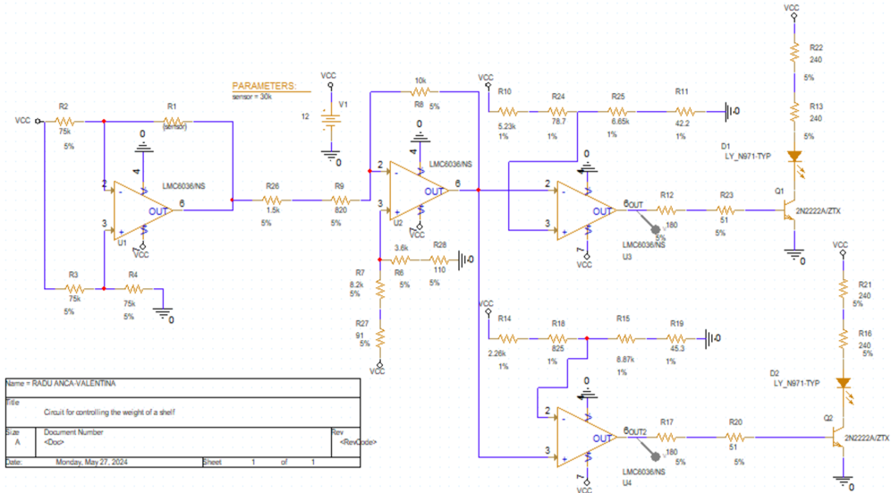

# Shelf Weight Control Circuit

Project Author: Radu Anca-Valentina
Subject: Computer Aided Design
University: Faculty of Electronics, Telecommunications and Information Technology, Technical University of Cluj-Napoca

## Task

**En:** Design a system for controlling the weight supported by a shelf dedicated to the storage of metal bars. The weight sensor measures weight linearly within a given resistance range, and the system converts this into a voltage signal, signaling with an LED when the shelf's weight falls outside the target range.

**Ro:** Să se proiecteze un sistem de control al greutății suportate de un raft dedicat depozitării unor bare metalice. Senzorul de greutate măsoară greutatea liniar într-un domeniu de rezistență dat, iar sistemul convertește acest lucru într-un semnal de tensiune, semnalizând cu ajutorul unui LED atunci când greutatea raftului iese din domeniul țintă.

## Design Data

| Parameter | Value |
|---|---|
| Measurable weight range | 20–110 kg |
| Target weight range (shelf) | 80–100 kg |
| Sensor resistance | 18–47 kΩ |
| VCC | 12 V |
| LED color | Yellow |

## Approach

The circuit is built in four stages:

1. **Active bridge**: models the weight sensor as a variable resistance and linearizes its output.
2. **Inverting voltage domain converter**: rescales the bridge output to a 0–10V range.
3. **Two simple comparators** (inverting and non-inverting): compare the voltage against reference thresholds corresponding to the 80 kg and 100 kg boundaries.
4. **LED + BJT ensembles**: amplify the comparator output current to drive the yellow LEDs, since the comparator output alone couldn't supply the LED's required forward current.

All resistor values were standardized to real E-series components (1% and 5% tolerance) after initial calculation.

## Results

- The LED turns on whenever the shelf's weight goes outside the 80–100 kg target range, confirmed via DC sweep simulation.
- LED current after standardization sits at approximately 20.45 mA, matching the LED's rated forward current of 20 mA.
- Monte Carlo and worst-case analysis show R3 and R6 as the most sensitive components to tolerance variation (up to 3.55 sigma deviation), flagged as the main area for further refinement.
- Full bill of materials totals 80.41 RON.

## Tools

Designed and simulated in OrCAD Capture / PSpice, including DC sweep, transient, Monte Carlo, and worst-case analyses.

## Final Schematic

## Documentation

Full write-up with schematics, calculations, and simulation results: [CAD_PROJECT_RADU_ANCA_documentation.pdf](./CAD_PROJECT_RADU_ANCA_documentation.pdf)
